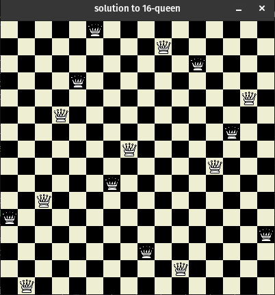

# $N$-Queen Solver Using Genetic Algorithm

This implementation is based on the concepts and namings in Norvig and Russel's
book, Artificial Intelligence: A Modern Approach. Other resources are also used
that are included in the Persian report that is also available.

You can change the parameters in the main function's `Population` object.
The first parameter is the $N$ itself, the second the number of population and 
the third mutation rate.

A solution may not be found in a run and so multiple runs should be done to get
a solution.

Here is a solution obtained for $N = 16$.

